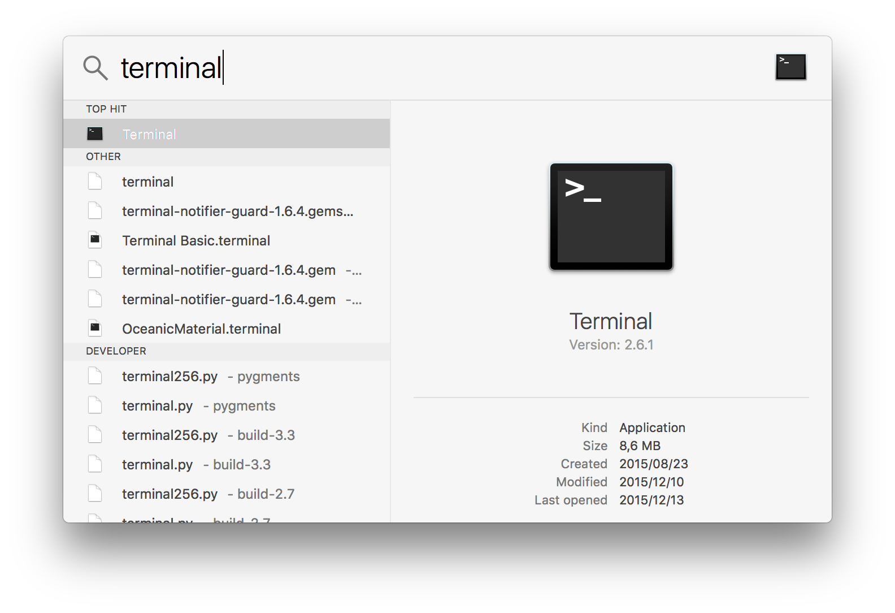
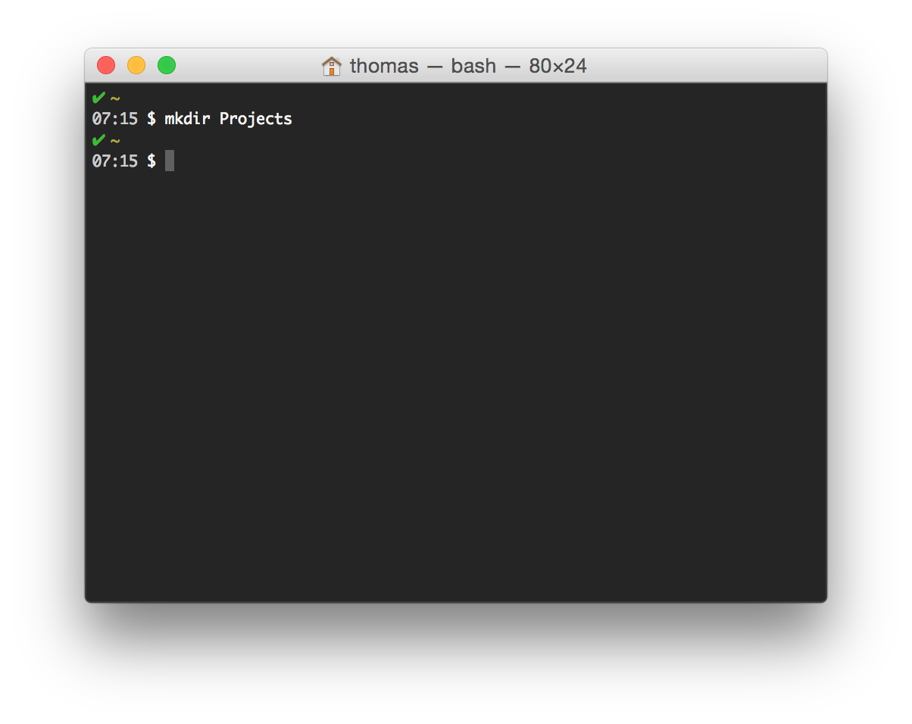

## The Terminal

There's are a ton of different terminal commands you can use. We'll only cover the basic ones that still will get you pretty effective in the command line.

### Find your terminal

#### Mac OSX

Use the Terminal program, located in your `Applications/Utilities` folder.

Another quick way to start it is by using `cmd + space` then search terminal.

One tip I usually give to everybody that cares to listen, is to change the color profile of the terminal to a dark background. It makes it easier to work in the long run. Open up Settings and change the profile to Pro. 

### Current Directory ( `pwd` )
`pwd` — stands for Present Working Directory and will show you a clear path to your location.

### List files ( `ls` )

### Create directories ( `mkdir` )
You create folders with `mkdir`. Simply type `mkdir Projects` and your new folder will be created.

### Change directories ( `cd` )

### Create files
The command for creating a file is called `touch`, so if we wanted to create a ruby source file called script, we would type `touch script.rb`

### Copy files ( `cp` )
The syntax for this command is straightforward: `cp` followed by the file name — `script.rb` followed by the path to the directory you want to save it in. In our case, the full command looks like this: `cp script.rb /Users/Thomas/Projects/`, or, using a relative path command, `cp script.rb ../Projects`. 

### Delete files ( `rm` )
The command for deleting a file is `rm`. The command for this is simply `rm script.rb`.

To be on the safe side, you can use the `-i` parameter to toggle interactive mode, where the Terminal will explicitly confirm your deletion command before executing it, in this case asking us if we want to `remove script.rb?` We can then answer `yes` or simply `y` to proceed.

### Move files ( `mv` )