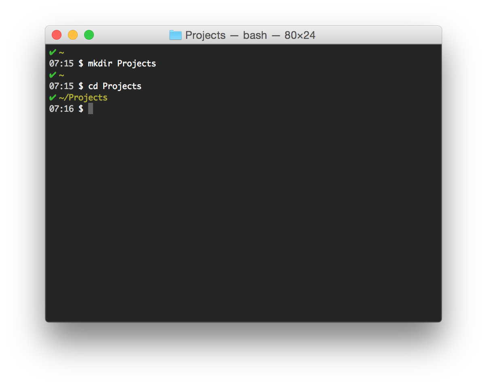
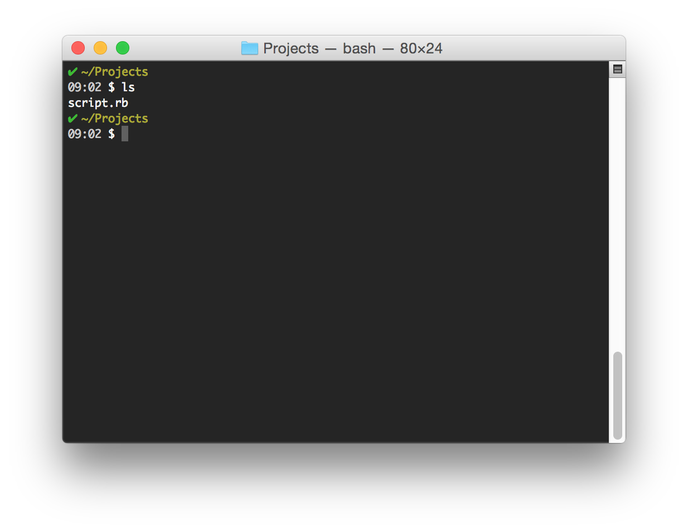
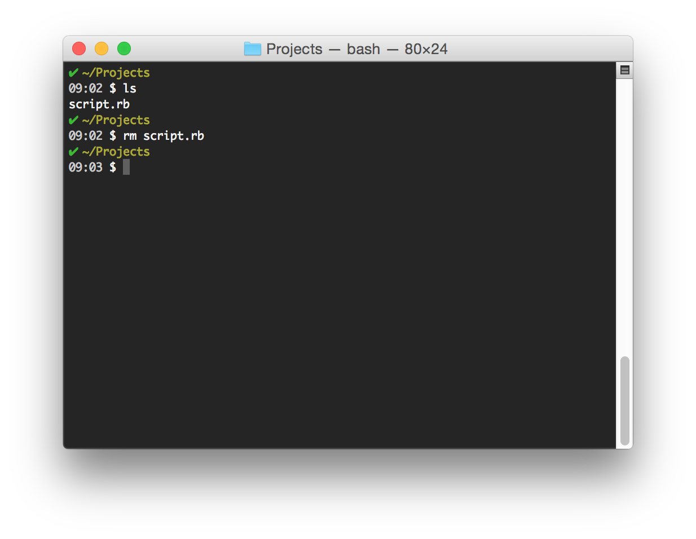
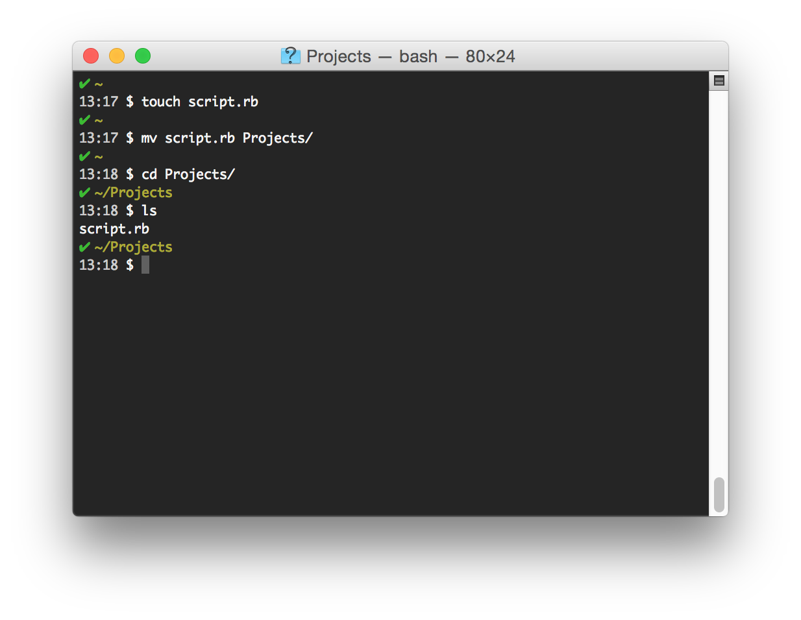
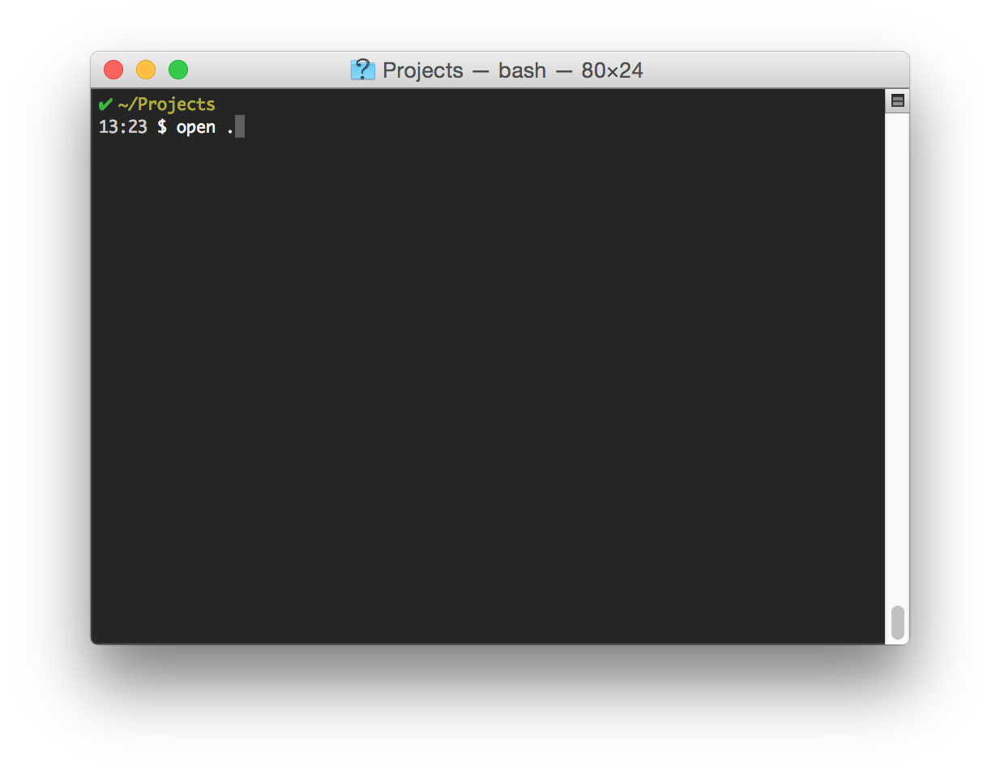

## The Terminal

There's are a ton of different terminal commands you can use. We'll only cover the basic ones that still will get you pretty effective in the command line.

### Find your terminal

#### Mac OSX

Use the Terminal program, located in your `Applications/Utilities` folder.

Another quick way to start it is by using `cmd + space` then search terminal.

One tip I usually give to everybody that cares to listen, is to change the color profile of the terminal to a dark background. It makes it easier to work in the long run. Open up Settings and change the profile to Pro. 

## Basic commands
We will only cover some very basic commands. Each and every one commands we list here can be used in a variety of ways - some very complicated. Don't worry about that but know that you can do almost anything you might imagine using the CLI (command line interface) and as a programmer, you should get used to it. We will be introducing more advanced commands as we progress, but for now, let's settle fot these basic ones.

If you feel that you want to dig deeper into the command line, we suggest that you go through the [Command Line Crash Course](http://cli.learncodethehardway.org/book/). It's a great free resource. 

### Current Directory - `pwd` 
`pwd` — stands for Present Working Directory and will show you a clear path to your location.

### Create directories - `mkdir` 
You create folders with `mkdir`. Simply type `mkdir Projects` and your new folder will be created.

### Change directories - `cd` 

### Create files
The command for creating a file is called `touch`, so if we wanted to create a ruby source file called script, we would type `touch script.rb`

### List files - `ls` 
The `ls` command lists all files and subfolders in the current folder.

### Copy files - `cp` 
The syntax for this command is straightforward: `cp` followed by the file name — `script.rb` followed by the path to the directory you want to save it in. In our case, the full command looks like this: `cp script.rb /Users/thomas/Projects/`, or, using a relative path command, `cp script.rb ../Projects`. 

### Delete files ( `rm` )
The command for deleting a file is `rm`. The command for this is simply `rm script.rb`.

To be on the safe side, you can use the `-i` parameter to toggle interactive mode, where the Terminal will explicitly confirm your deletion command before executing it, in this case asking us if we want to `remove script.rb?` We can then answer `yes` or simply `y` to proceed.

### Move files - `mv`
Instead of copying a file there are times when you want to move a file all together. You can do that with the `mv` command. 

### Open folder in text editor
You can start your text editor from the command line as well:

### Open folder in finder
Or, if you wish to navigate the folder in Finder, you can do it using the `open` command:

