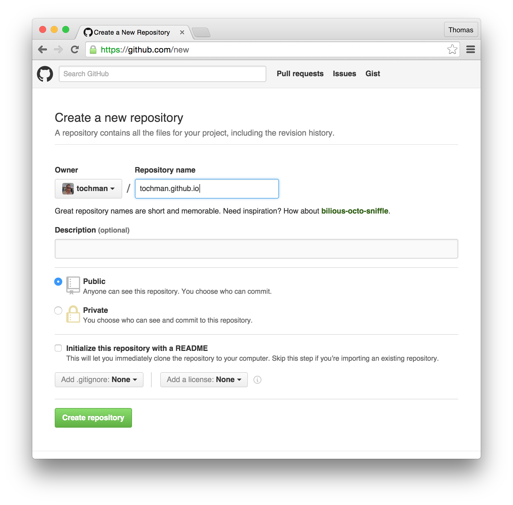
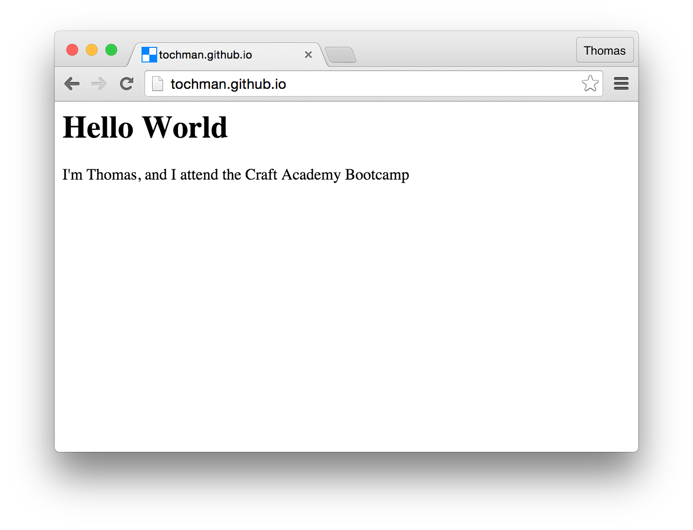

## Your first website

It's all about the web. During this course we'll be building a lot of applications. For starters we'll be writing small pieces of software that will be run on our own computers. Relatively soon we'll move on to more advanced applications built to be deployed an run on a web server.

The idea is that you get to master the different techniques before we introduce another layer of complexity. Before you know it we'll be deploying fully featured, dynamic web apps on virtual servers. But not today. Today we'll learn how to crawl so that we can run an marathon in the future.

#### Learning experience
In this exercise we will start scratching the surface of html and css and build a small static web page - and deploy it on the internet for everybody to see. We'll also get a chance to practice some git-skills - an essential part of your skill-set as a developer. 

### Walkthrough

All of us are using GitHub for storage of our code in the cloud and for collaboration. If you still don't have a GitHub account - then you should definitely head over to their site and [set up an account ASAP](https://github.com).

One of the many features of GitHub offers is the possibility of to create web sites for users and projects. We'll take advantage of that feature to publish a personal web site.

Head over to GitHub and create a new repository named `username.github.io`, where username is your username on GitHub. In my case it would be:  `tochman.github.io`. If the first part of the repository name doesn't exactly match your username, it won't work, so make sure to get it right.



In your terminal, go to the folder where you want to store your project, and clone the new repository:

```html
$ git clone https://github.com/username/username.github.io
$ cd username.github.io
$ echo "<h1>Hello World</h1>" > index.html
$  echo "<p>I'm Thomas, and I attend the Craft Academy Bootcamp<p>" >> index.html
```

Use Git to commit, and push your changes to GitHub:
```shell
$ git add .
$ git commit -m "initial commit"
$ git push origin master
```

** Open your browser and go to `username.github.io`. **

You have just deployed your first web site. 



### The look and feel of your site

Okay, so now you have published your first website. It is **NOT** an application - it is just a static site. Since we are using GitHub's very generous mechanism for publishing personal or project websites, we are limited in what we can do in terms of functionality. We won't be able to create an fully featured application on this platform. But we can, however, take the opportunity and practice some basic HTML and CSS skills, as well as version control.

As the next step, I would like you to open the `index.html` in your editor.

In your terminal window while in the project folder, type in the following command and press enter:

```shell
$ atom .
```
That will open the Atom editor. It should look something like that:

[SCREENSHOT]

Now you can double-click the `index.html` and open it for editing. We want to make the following changes to that file:

```html
<!DOCTYPE HTML>

<html>
<head>
  <meta http-equiv="Content-Type" content="text/html; charset=UTF-8" />
  <title>My First Website</title>
</head>

<body>
  <h1>Hello World</h1>
  <p>I'm Thomas, and I attend the Craft Academy Bootcamp<p>
</body>

</html>
```

What we've done now is we added the very basic HTML5 document structure. 


